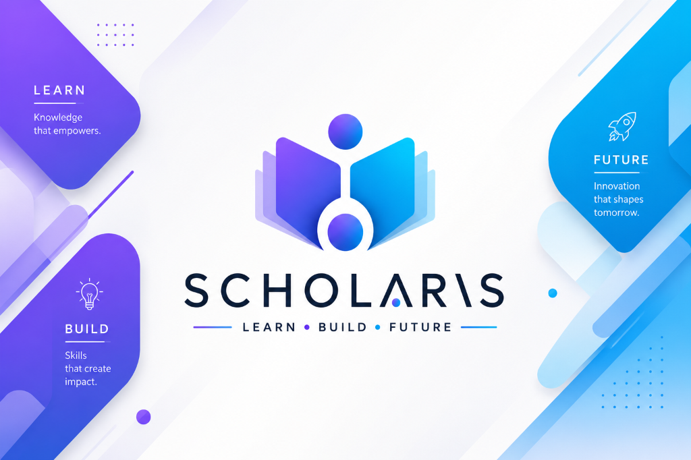

# Scholaris Community Edition 🎓

<p align="center">
  
</p>

<p align="center">
  <a href="LICENSE"></a>
  <a href="https://www.odoo.com"></a>
  <a href="https://www.postgresql.org"></a>
  <a href="https://www.docker.com"></a>
  <a href="https://python.org"></a>
  <a href="https://pre-commit.com/"></a>
</p>

---

## 📖 About Scholaris

Scholaris is a comprehensive, enterprise-grade **Educational Resource Planning (ERP)** system built specifically for K-12 schools, colleges, academies, and universities. By integrating student lifecycles, administrative operations, billing, scheduling, and academic assessments, Scholaris eliminates data silos and reduces manual overhead for modern institutions.

### Who It Serves (Key Personas)
*   **🏫 Administrators**: Orchestrate academic calendars, coordinate course enrollment registers, manage classroom asset allocation, and oversee financial invoice generation.
*   **👨‍🏫 Faculty & Teachers**: Manage class schedules, track student attendance, assign homework/tasks, and publish grades/evaluation marks.
*   **🧑‍🎓 Students**: Keep track of schedules, check out library books, complete assignments, view portal transcripts, and register for subjects.
*   **👪 Parents**: Check academic progress, track attendance logs, look up fee details, and maintain active communication channels with the school administration.

---

## 🚀 Key Modules & Capabilities

Scholaris uses a modular architecture where every module represents an independent layer of school operations:

*   **🏫 Core Academics**: Manage base configurations including Student & Faculty profiles, Courses, Batches, Subjects, and Departments ([scholaris_core](file:///home/a-n/Documents/BUSINESS/school/scholaris/scholaris_core)).
*   **🎟️ Admissions Registry**: Streamline candidate application forms, review pipelines, and automatic portal user creations ([scholaris_admission](file:///home/a-n/Documents/BUSINESS/school/scholaris/scholaris_admission)).
*   **💰 Finance & Billing**: Define structured installment schedules, manage discounts, and generate standard invoices directly through Odoo accounting ([scholaris_fees](file:///home/a-n/Documents/BUSINESS/school/scholaris/scholaris_fees)).
*   **📅 Timetables & Sessions**: Define time slots, assign rooms to schedules, and prevent timing clashes ([scholaris_timetable](file:///home/a-n/Documents/BUSINESS/school/scholaris/scholaris_timetable)).
*   **📝 Daily Attendance**: Generate session-wise student check-sheets to track present/absent logs ([scholaris_attendance](file:///home/a-n/Documents/BUSINESS/school/scholaris/scholaris_attendance)).
*   **📚 Library Systems**: Issue and return books, configure queue reservations, manage library cards, and automate fine generation ([scholaris_library](file:///home/a-n/Documents/BUSINESS/school/scholaris/scholaris_library)).
*   **📝 Exam Evaluations**: Schedule classroom tests, assign room tables, manage grading thresholds, and generate marksheet documents ([scholaris_exam](file:///home/a-n/Documents/BUSINESS/school/scholaris/scholaris_exam)).
*   **📬 Assignment Posts**: Publish assignments, accept student uploads, and log grading marks ([scholaris_assignment](file:///home/a-n/Documents/BUSINESS/school/scholaris/scholaris_assignment)).
*   **👥 Parents Portal**: Establish parent-child relational groups for easy portal observation ([scholaris_parent](file:///home/a-n/Documents/BUSINESS/school/scholaris/scholaris_parent)).

---

## 🛠️ Technology Stack

*   **Server Framework**: Odoo 18.0 (Community Edition)
*   **Database Management**: PostgreSQL 15
*   **Application Logic**: Python 3.10+
*   **Interface Templates**: Odoo OWL JS & XML templating Engine
*   **Styles**: Vanilla SCSS (Odoo standard assets pipelines)

---

## ⚡ Quick Start (Local Setup)

Run the full stack locally in minutes using Docker.

### Prerequisites
Ensure your local machine has **Docker** and **Docker Compose** installed and running.

### 1. Launch the Containers
From the root of the project directory, run:
```bash
docker compose up -d
```

### 2. Configure Database & Login
1. Navigate to **[http://localhost:8069](http://localhost:8069)** in your browser.
2. Complete the initialization form:
    *   **Database Name**: `scholaris_db`
    *   **Admin Email & Password**: E.g. `admin` / `admin`
    *   **Demo Data**: Check this box to load default subjects, courses, and students.
3. Click **Create Database**.

### 3. Install the Modules
1. Navigate to the **Apps** menu from Odoo's top navigation bar.
2. Clear the "Apps" filter from the search bar and search for **Scholaris**.
3. Locate **Scholaris ERP** (`scholaris_erp`) and click **Activate** to install the entire suite.

---

## 📂 Repository Structure

```text
├── scholaris_core/         # Base student, faculty, course & department models
├── scholaris_admission/    # Student application and admission register flows
├── scholaris_fees/         # Invoicing integration and school fee structures
├── scholaris_timetable/    # Academic session schedules and timing presets
├── scholaris_attendance/   # Daily student registry check-sheets
├── scholaris_classroom/    # Classroom and facility allocation mapping
├── scholaris_facility/     # Asset inventory catalog
├── scholaris_exam/         # Grading setups, room listings, and marksheet results
├── scholaris_assignment/   # Assignments, deadlines, and online grading
├── scholaris_library/      # Book registry and check-in/checkout rules
├── scholaris_activity/     # Co-curricular events registry
├── scholaris_parent/       # Parent/guardian profile links
├── theme_web_scholaris/    # Custom web portal theme
└── docker-compose.yml      # Local container configurations
```

---

## 📄 License

Scholaris is distributed under the **LGPL-3.0 License**. See the [LICENSE](LICENSE) file for more details.
